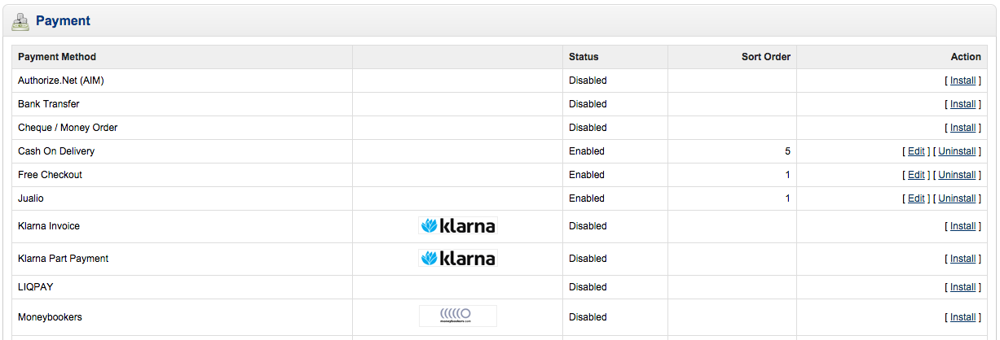
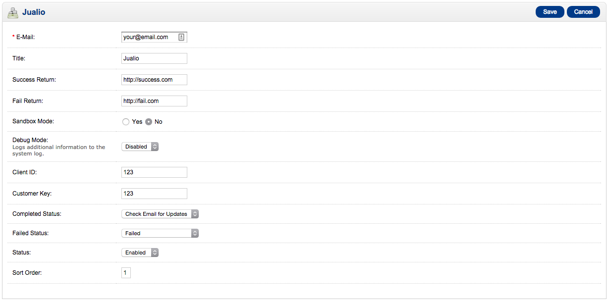

# Jualio for OpenCart

This extention allows you to accept payment on your OpenCart store using Jualio Payment Gateway. Curently this has been tested on OpenCart 1.5.4.

## Instalation

1. Download your copy of Jualio for OpenCart to your desktop.
2. Extract the extention folder to your desktop.
3. Read through the README.md file thoroughly to ensure you follow the installation instructions.
4. With your FTP program, upload the contents of the extention folder to their respective folder in your OpenCartdirectory online. For example the file `/jualio-for-opencart/admin/controller/payment/jualio.php` should be copied to `www.youropencartstore.com/public/admin/controller/payment/jualio.php`.
5. Login to your OpenCart store admin page and go to the Payment > Extensions screen, and find the newly uploaded Jualio Payment in the list. 
6. Click the install link

## Usage

1.  Login to your OpenCart store admin page and go to the Payment > Extensions screen, and click the edit link on the Jualio Payment
2.  Fill in the detail on the form. Refer to your Jualio account for your Client ID and Customer Key [screenshot-4.png]
3. Don't forget to select the 'Enable' Option on Status Input to enable Jualio for OpenCart
4. Click Save button

## Extension Options

- **E-Mail** : (required) The email address registered for your Jualio account.
- **Title** : (optional) The name of the Payment listed on the checkout page. If empty it will default to 'Jualio'.
- **Success Return** : (optional) Custom URL to be called after success payment. If empty it will default to your OpenCart payment result page.
- **Fail Return** : (optional) Custom URL to be called after failed payment. If empty it will default to your OpenCart payment result page.
- **Sandbox Mode** : Use the Jualio sandbox mode.
- **Debug Mode** : Logs additional information to the system log.
- **Client ID** : Your Jualio Account ID. Refer to your Jualio account for your Client ID and Customer Key.
- **Customer Key** : Your Jualio Customer Key. Refer to your Jualio account for your Client ID and Customer Key.
- **Completed Status** : Select the status for success payment status. You can create new status on the System > Settings page.
- **Failed Status** : Select the status for failed payment status. You can create new status on the System > Settings page.
- **Status** : Select the 'Enable' Option on Status Input to enable Jualio for OpenCart
- **Sort Order** : The order of the Payment listed on the checkout page.
